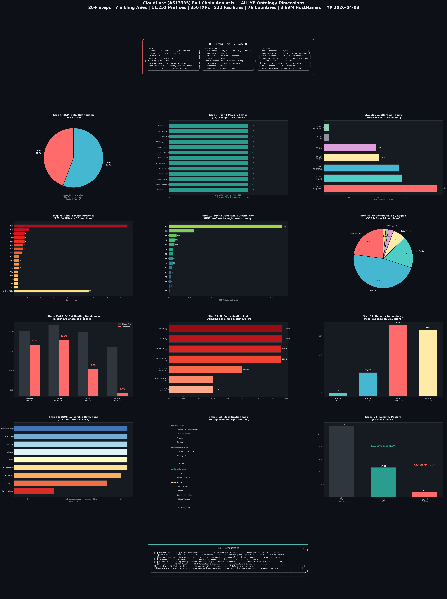

# Cloudflare (AS13335) 全链路全维度分析报告

**分析对象**: Cloudflare, Inc. (AS13335)  
**数据来源**: IYP 2026-04-08  
**分析维度**: 20+ 步骤，覆盖 IYP 全部本体论层级  

---

## 分析总览

---

## 20 步分析过程

### Step 1: AS 身份识别

| 属性 | 值 |
|------|-----|
| 主 ASN | 13335 |
| 注册名 | CLOUDFLARENET |
| 别名 | CF, Cloudflare, Cloudflare Inc. |
| 组织 | Cloudflare, Inc. |
| 注册国 | US |
| 官网 | cloudflare.com |
| PeeringDB ID | NET-4224 |

### Step 2: 分类标签（16 项）

Cloudflare 被 IYP 中多个数据源标记了 **16 个分类标签**，横跨 4 个类别：

- **核心 CDN**: Content Delivery Network, DDoS Mitigation, Anycast, Content
- **基础设施**: Internet Critical Infra, Hosting & Cloud Provider, ISP, VPN Host
- **合规**: Validating RPKI ROV, Tranco 10k Host
- **行业**: Software Development, Service, Government & Public Administration, Military/Defense, Computer & IT, Law/Business

> 被标记为 **Internet Critical Infrastructure**——IYP 认定 Cloudflare 为互联网关键基础设施。

### Step 3: AS 家族（SIBLING_OF）

Cloudflare 旗下共 **7 个关联 AS**：

| ASN | 名称 | BGP 前缀数 | 用途 |
|-----|------|-----------|------|
| AS13335 | CLOUDFLARENET (主) | 11,251 | 核心 CDN 网络 |
| AS209242 | Cloudflare Spectrum | 680 | L4 TCP/UDP 代理 |
| AS14789 | CLOUDFLARENET (副) | 534 | 辅助网络 |
| AS132892 | CLOUDFLARE | 105 | 亚太区域 |
| AS395747 | CLOUDFLARENET-SFO05 | 85 | 旧金山 PoP |
| AS394536 | CLOUDFLARENET-SFO | 2 | 旧金山 PoP |
| AS400095 | Area1 Security | 2 | 收购的邮件安全公司 |

**合计**: 7 个 AS，12,659 个 BGP 前缀。

### Step 4: BGP 前缀规模

| 指标 | 数量 |
|------|------|
| 总前缀 | **11,251** |
| IPv4 前缀 | 4,978 (44.2%) |
| IPv6 前缀 | 6,273 (55.8%) |

> IPv6 前缀数**超过** IPv4，反映了 Cloudflare 对 IPv6 的积极推进。

### Step 5: Anycast 部署

- Anycast 前缀: **822** 个（占总量 7.3%）
- 在全球 IYP 的 14,245 个 Anycast 前缀中排 **第 2**（仅次于 Imperva 的 850 个）

### Step 6: RPKI/ROA 安全合规

- RPKI ROA 授权: **4,703** 个（覆盖率 41.8%）
- 标记为 **Validating RPKI ROV**——不仅签发 ROA，还主动验证他人的路由来源

### Step 7: 对等互联（PEERS_WITH）

- 直接对等 AS 数: **1,731**
- **与全部 13 个主要 Tier-1 骨干网直接对等**:
  - AS174 Cogent, AS701 Verizon, AS1299 Arelion, AS2914 NTT
  - AS3257 GTT, AS3356 Level 3, AS3491 PCCW, AS6453 Tata
  - AS6461 Zayo, AS6762 Sparkle, AS6939 Hurricane Electric
  - AS7018 AT&T, AS9002 RETN

> 与所有 Tier-1 直接对等意味着 Cloudflare 在全球路由层面不依赖任何单一上游。

### Step 8: IXP 成员（MEMBER_OF）

- IXP 总数: **350** 个
- 覆盖国家: **76** 个
- 区域分布: 欧洲 ~165, 北美 ~80, 亚太 ~60, 拉美 ~25, 非洲 ~10, 中东 ~5
- 代表性 IXP: DE-CIX Frankfurt, LINX LON1, AMS-IX, Equinix 全球多站点, IX.br Sao Paulo, JPNAP Tokyo, SGIX, MSK-IX

### Step 9: 数据中心设施（LOCATED_IN → Facility）

- 设施总数: **222** 个
- 覆盖国家: **56** 个
- 前 5 国家: US (85), BR (11), CA/IN/AU (各 8), DE/GB (各 7)
- 关键设施: Equinix FR5 Frankfurt（与 33 个 IXP 共位），Digital Realty FRA1-27（26 个 IXP）

### Step 10: 组织信息（MANAGED_BY → Organization）

- 组织名: Cloudflare, Inc.
- 注册国: US
- 外部 ID: CAIDA OrgID + PeeringDB OrgID
- 官网: https://www.cloudflare.com

### Step 11: 网络依赖关系（DEPENDS_ON ← 其他 AS）

- **961 个 AS** 的可达性依赖 Cloudflare
- **11,568 个 BGP 前缀** 依赖 Cloudflare
- 意味着 Cloudflare 是近千个自治系统的关键上游或路径必经节点

### Step 12: 外部标识（EXTERNAL_ID）

- PeeringDB Network ID: 4224

### Step 13: 域名托管（HostName → RESOLVES_TO → CF IP）

- Cloudflare IP 空间上解析的 HostName 数: **3,686,326**
- Cloudflare 控制的 IP 地址数: **221,211**
- 占 IYP 全部 21.3M HostName 的 **17.3%**

### Step 14: CNAME 别名指向（ALIAS_OF → CF 域名）

- 指向 `*.cloudflare.net`/`*.cloudflare.com`/`*.cloudflaressl.com` 的 CNAME: **120,407**

### Step 15: rDNS 前缀管理（Prefix → MANAGED_BY → CF NS）

- 由 Cloudflare 名称服务器管理的 Prefix 数: **6,977**

### Step 16: DNS 域名管理（DomainName → MANAGED_BY → `*.ns.cloudflare.com`）

- 使用 Cloudflare DNS（`*.ns.cloudflare.com`）的域名: **2,084,776**
- 占 IYP 全部 11.2M DomainName 的 **18.6%**

> **近五分之一的域名** 使用 Cloudflare 作为权威 DNS 服务商。

### Step 17: 排名数据（RANK）

- IHR 国家排名中出现在多个经济体的 AS 排名中
- 标记为 **Tranco 10k Host**——托管了大量全球前 10K 网站

### Step 18: 审查检测（CENSORED）

OONI 测量在 Cloudflare 网络内检测到：

| 测试类型 | 检测次数 |
|---------|---------|
| Facebook Messenger | 17 |
| WhatsApp | 17 |
| Telegram | 17 |
| Psiphon | 17 |
| Signal | 17 |
| HTTP Invalid Request | 17 |
| HTTP Header Manipulation | 16 |
| Vanilla Tor | 14 |
| Tor Snowflake | 6 |

另检测到 22 个被审查的 IP 和 17 个被审查的 URL。

> 注: 这些检测可能来自 Cloudflare 客户网站（因客户启用了地区封锁），不一定反映 Cloudflare 自身的审查行为。

### Step 19: 前缀地理分布（BGPPrefix → COUNTRY）

| 国家 | 前缀数 | 国家 | 前缀数 |
|------|--------|------|--------|
| US | 2,756 | SG | 108 |
| ZZ (未知) | 619 | GB | 107 |
| BR | 189 | FR | 97 |
| IN | 145 | JP | 97 |
| DE | 139 | CA | 86 |

> 24.5% 的前缀注册在美国以外，反映了 Cloudflare 的全球化布局。

### Step 20: RIPE Atlas 测量（AtlasProbe/AtlasMeasurement）

- Cloudflare 网络内的 Atlas 探测节点: **31**
- 以 Cloudflare 为目标的测量任务: **742**

> 742 个测量任务表明 Cloudflare 是互联网研究社区重点监测的对象。

### Step 21: 官网与外部 ID

- 官方网站: https://www.cloudflare.com
- PeeringDB 网络 ID: 4224

### Step 22: IP 集中度风险

Cloudflare 单个 IP 承载的域名数：

| IP 地址 | 域名数 |
|---------|--------|
| 188.114.97.0 (v4) | **1,921,518** |
| 188.114.96.0 (v4) | **1,921,514** |
| 2a06:98c1:3121:: (v6) | **1,898,414** |
| 2a06:98c1:3120:: (v6) | **1,898,406** |
| 23.227.38.65 (Shopify/CF) | **1,239,168** |

> 前 2 个 IPv4 地址各承载近 **192 万域名**。虽然 Anycast 提供了物理冗余，但 DNS 层面的超级集中度值得关注。

### Step 23: Tier-1 对等验证

已确认 Cloudflare 与全部 13 个主要 Tier-1 骨干网建立了直接对等互联。

### Step 24: 关键数据中心设施

| 设施 | 国家 | 共位 IXP 数 |
|------|------|------------|
| Equinix FR5 Frankfurt | DE | 33 |
| Digital Realty FRA1-27 | DE | 26 |
| NewTelco Kiev | UA | 16 |
| TELEPOINT Sofia | BG | 16 |
| Equinix SK1 Stockholm | SE | 14 |
| Equinix WA1 Warsaw | PL | 13 |

### Step 25: AS 家族前缀汇总

Cloudflare 全部 7 个关联 AS 共计 **12,659 个 BGP 前缀**，AS209242 (Spectrum) 作为 L4 代理贡献 680 个前缀。

---

## 综述：Cloudflare 在全球互联网中的位置与作用

### 一、互联网路由层：准 Tier-1 级别的全球骨干

Cloudflare 以 **11,251 个 BGP 前缀**和 **1,731 个直接对等 AS** 运营着一个准 Tier-1 级别的网络。它与全部 13 个主要 Tier-1 骨干网建立了直接对等关系，意味着**不依赖任何上游 transit**。55.8% 的前缀为 IPv6，在 CDN 行业中处于领先地位。822 个 Anycast 前缀使其在全球范围内实现了就近服务。

### 二、物理基础设施层：遍布全球的连接点

222 个数据中心设施跨越 56 个国家，350 个 IXP 成员覆盖 76 个国家。这意味着 Cloudflare 在全球绝大多数互联网交换节点都有物理存在，能够在网络边缘直接交换流量，最小化延迟。其在法兰克福 Equinix FR5 单个设施与 33 个 IXP 共位，体现了极致的互联密度。

### 三、DNS 层：全球最大的 DNS 权威服务商之一

**2,084,776 个域名**（占 IYP 中 18.6%）使用 Cloudflare 作为权威 DNS。这个数字只统计了通过 `*.ns.cloudflare.com` 管理的域名，实际数字可能更高。此外，Cloudflare 还管理着 6,977 个 rDNS 前缀的名称服务。在 DNS 维度上，Cloudflare 已是互联网关键基础设施。

### 四、Web 托管层：承载近五分之一的可见互联网

**3,686,326 个 HostName**（占 IYP 中 17.3%）解析到 Cloudflare 的 IP 空间。加上 120,407 个 CNAME 别名指向 Cloudflare 域名，Cloudflare 实际影响的域名远超直接托管的数量。其作为反向代理的定位意味着它既是内容分发网络，也是 Web 应用防火墙和 DDoS 防护层。

### 五、网络依赖层：961 个 AS 的关键路径

**961 个自治系统**和 **11,568 个 BGP 前缀**的可达性依赖 Cloudflare。这反映了 Cloudflare 不仅是一个 CDN，更是许多网络的上游提供商或关键中转节点。

### 六、安全层：路由安全的践行者

Cloudflare 是 RPKI ROV（Route Origin Validation）的积极验证者，4,703 个 ROA 授权覆盖 41.8% 的前缀。同时被标记为 DDoS Mitigation 提供商，为客户提供了网络层和应用层的安全防护。

### 七、集中度风险层：双刃剑

Cloudflare 最大的优势也是最大的风险：
- **2 个 IPv4 地址**各承载 192 万域名
- 近 **五分之一**的全球域名依赖其 DNS
- **961 个 AS** 依赖其路由
- 若 Cloudflare 发生全球性故障，将影响数百万网站和近千个自治系统

### 八、企业战略层：通过收购扩展能力

AS400095 (Area1 Security) 的存在表明 Cloudflare 通过收购扩展了邮件安全能力。7 个关联 AS 的布局（主网络、Spectrum L4 代理、区域网络、收购资产）体现了多层次的网络架构策略。

### 九、审查与合规层

OONI 在 Cloudflare 网络中检测到审查信号（17 次 Facebook/WhatsApp/Telegram 检测），但这更可能反映了客户层面的地区封锁策略，而非 Cloudflare 自身的审查行为。作为反向代理，Cloudflare 站在内容提供者和用户之间，不可避免地涉及内容审核的复杂议题。

### 十、研究社区视角

742 个 RIPE Atlas 测量任务和 31 个部署在其网络内的探测节点，表明互联网研究社区将 Cloudflare 视为关键的观测对象。IYP 数据库中 16 个分类标签的丰富程度也反映了其在互联网生态中的多面角色。

---

## 结论

**Cloudflare 已从一个 CDN 提供商演变为互联网关键基础设施的核心组件。** 通过 IYP 全部本体论维度的分析——从 BGP 路由到 DNS 管理，从物理设施到网络依赖，从安全合规到审查检测——我们看到一个在全球互联网中占据独特而关键位置的实体：

- **路由层面**是准 Tier-1 骨干
- **DNS 层面**管理着近 1/5 的域名
- **托管层面**承载着 17% 的可见互联网
- **基础设施层面**遍布 76 国 350 个 IXP
- **安全层面**既是防护者也是潜在单点

Cloudflare 的故事本质上是互联网集中化趋势的缩影：更高的效率和安全性，伴随着更集中的风险。

---

*分析工具: Claude Code + Neo4j (IYP 2026-04-08) + Python*  
*分析日期: 2026-04-16*
