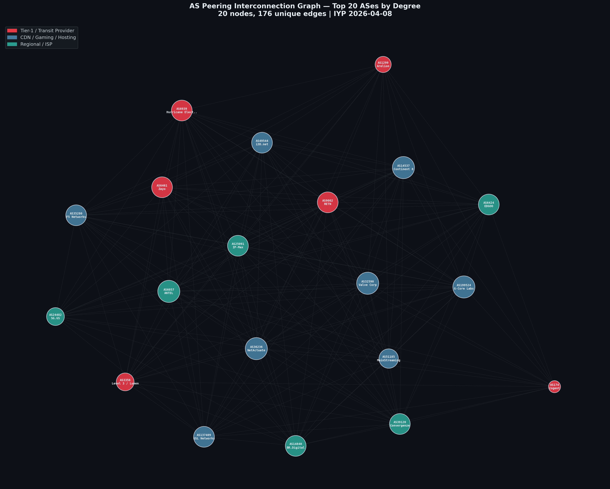
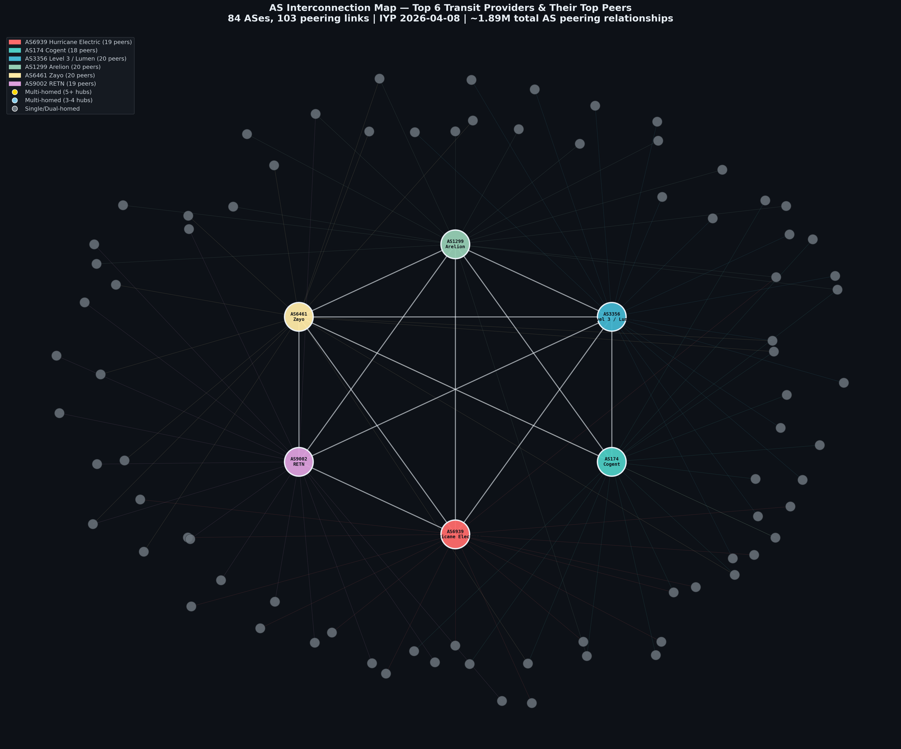
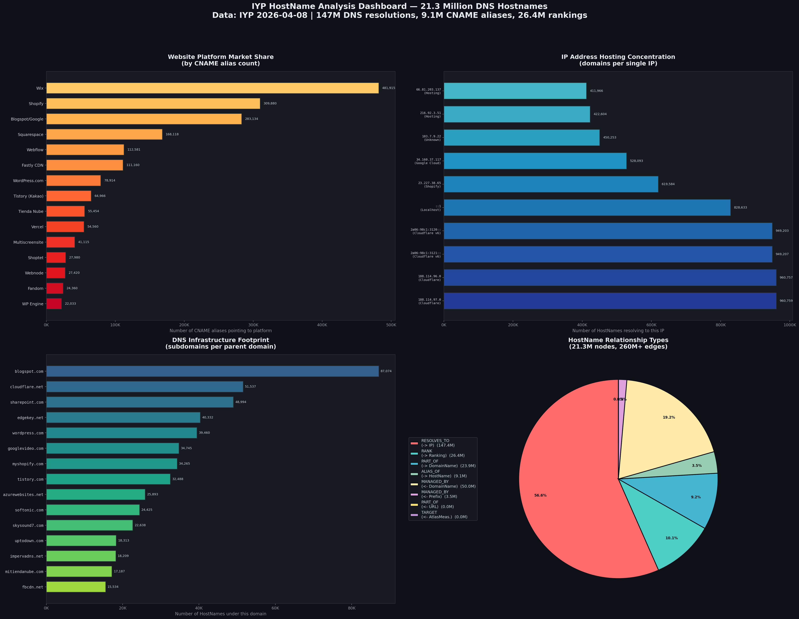
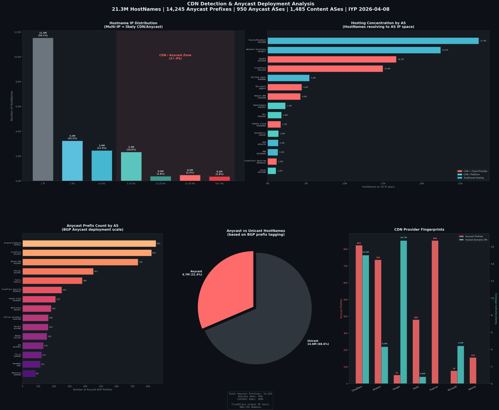
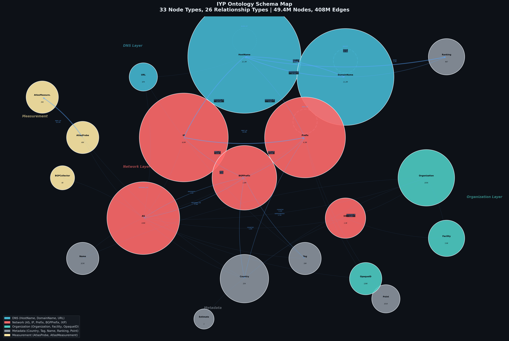
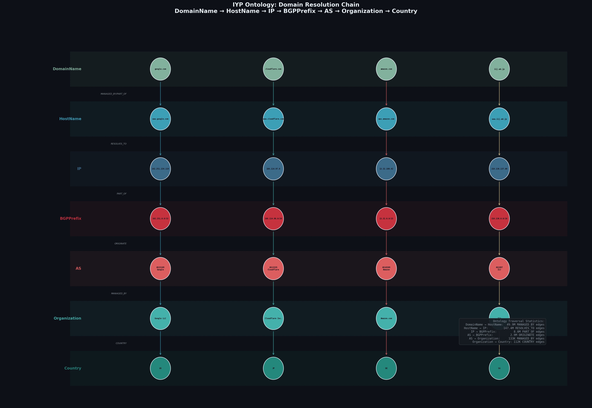
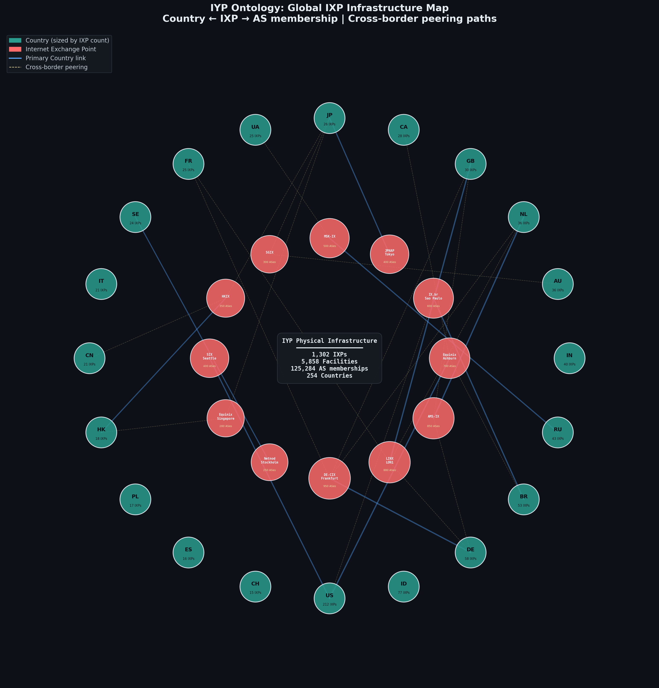
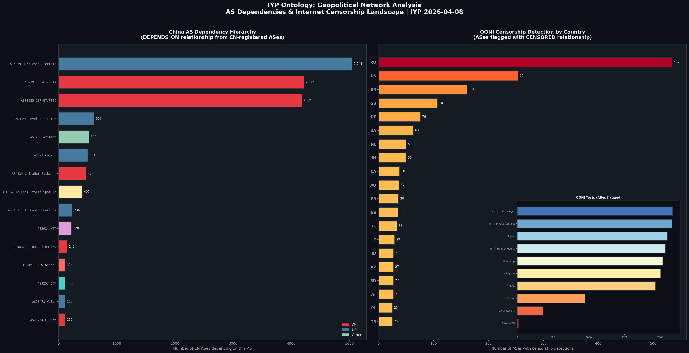

# IYP 数据库分析报告

**数据来源**: Internet Yellow Pages (IYP) 2026-04-08 数据库快照  
**分析日期**: 2026-04-16  
**数据库规模**: 4936 万节点 / 4.08 亿关系 / 33 种节点类型 / 26 种关系类型

---

## 目录

1. [数据库全局概览](#1-数据库全局概览)
2. [AS 互联关系分析](#2-as-互联关系分析)
3. [HostName 域名分析](#3-hostname-域名分析)
4. [CDN 检测与 Anycast 部署分析](#4-cdn-检测与-anycast-部署分析)
5. [基于本体论的网络分析](#5-基于本体论的网络分析)
6. [关键发现与结论](#6-关键发现与结论)

---

## 1. 数据库全局概览

### 1.1 节点规模

| 节点类型 | 数量 | 说明 |
|----------|------|------|
| HostName | 21,298,259 | DNS 全限定域名 (FQDN) |
| DomainName | 11,184,278 | DNS 域名 |
| IP | 7,959,870 | IPv4/IPv6 地址 |
| Prefix | 6,260,123 | IP 前缀（含 BGP/RIR/Geo 等子类型叠加） |
| BGPPrefix | 1,553,954 | BGP 宣告的 IP 前缀 |
| Name | 323,344 | 网络资源名称标签 |
| AS | 129,748 | 自治系统 |
| OpaqueID | 127,529 | RIR 资源持有者标识 |
| Organization | 105,239 | 组织实体 |
| Point | 100,944 | 地理坐标点 |

### 1.2 关系规模

| 关系类型 | 数量 | 说明 |
|----------|------|------|
| RESOLVES_TO | 147,352,606 | DNS 解析 (HostName → IP) |
| PART_OF | 123,158,944 | 归属关系 (IP → Prefix 等) |
| MANAGED_BY | 53,629,621 | 管理关系 (DomainName → AuthNS 等) |
| RANK | 27,801,280 | 排名关系 |
| PARENT | 11,003,943 | 域名层级 |
| SIBLING_OF | 10,549,163 | 前缀同源 |
| ALIAS_OF | 9,104,815 | CNAME 别名 |
| COUNTRY | 7,099,333 | 国家关联 |
| DEPENDS_ON | 6,623,787 | AS/前缀依赖 |
| CATEGORIZED | 3,102,050 | 资源分类标签 |
| ORIGINATE | 2,926,981 | BGP 前缀宣告 (AS → Prefix) |
| PEERS_WITH | 1,897,271 | AS 对等互联 |

### 1.3 构建概况

- **构建时间**: 约 43 小时 (2026-04-08 06:00 → 2026-04-10 01:27)
- **爬虫总数**: 78 个
- **崩溃爬虫**: 6 个（virginiatech.rovista SSL 失败、caida.ixs/ix_asns 数据不可用、alice_lg.sfmix 404、cloudflare IDN 域名 400 错误）
- **后处理**: 4 个 (ip2prefix, address_family, country_information, url2hostname)

---

## 2. AS 互联关系分析

IYP 数据库中共记录了 **129,748 个自治系统**和 **1,897,271 条 AS 对等互联关系**（PEERS_WITH），覆盖了全球互联网核心骨干的拓扑结构。

### 2.1 Top 20 AS 互联全景

按对等度（peering degree）选取前 20 个 AS 的互联关系图：



**核心发现**:

| 排名 | AS | 名称 | 对等度 |
|------|----|------|--------|
| 1 | AS6939 | Hurricane Electric | 33,329 |
| 2 | AS174 | Cogent | 27,562 |
| 3 | AS3356 | Level 3 / Lumen | 25,749 |
| 4 | AS24482 | SG.GS | 21,519 |
| 5 | AS49544 | i3D.net | 19,716 |
| 6 | AS35280 | F5 Networks | 16,186 |
| 7 | AS39120 | Convergenze | 14,502 |
| 8 | AS36236 | NetActuate | 13,575 |
| 9 | AS1299 | Arelion (Telia) | 12,603 |
| 10 | AS32590 | Valve Corporation | 12,271 |

- Top 20 AS 之间形成了 **176 条唯一互联边**（最多可能 190 条），几乎完全互联。
- 节点按类型着色：红色 = Tier-1 骨干、蓝色 = CDN/游戏/托管、青色 = 区域 ISP。
- Hurricane Electric 的对等度远超其他 AS，体现了其作为全球最大 IXP 参与者的地位。

### 2.2 六大骨干运营商与对等网络

选取 6 个全球主要骨干运营商作为核心节点，展示其与 Top 对等网络的互联结构：



**架构特征**:

- **核心层**: 6 大骨干（Hurricane Electric、Cogent、Level 3、Arelion、Zayo、RETN）之间完全互联，形成全球互联网核心 mesh。
- **边缘层**: 78 个对等 AS 分布在各骨干周围，按主要上游归类。
- **多宿模式**: 金色节点连接 5+ 骨干，实现高冗余；灰色节点仅连接 1-2 个骨干，存在单点依赖风险。
- 总计 84 个 AS、103 条互联链路。

---

## 3. HostName 域名分析

IYP 中包含 **21,298,259 个 HostName**（DNS 全限定域名），关联了 1.47 亿条 DNS 解析记录、910 万条 CNAME 别名和 2640 万条排名数据。

### 3.1 综合分析仪表盘



### 3.2 建站平台市场份额（CNAME 分析）

通过统计 CNAME 别名指向（ALIAS_OF 关系），可以从 DNS 层面还原全球建站平台的真实使用量——这比任何问卷调研都更准确：

| 排名 | 平台 | CNAME 指向数 | 说明 |
|------|------|-------------|------|
| 1 | **Wix** | 481,915 | 包含 cdn1.wixdns.net + pointing.wixdns.net |
| 2 | **Shopify** | 309,880 | shops.myshopify.com |
| 3 | **Google/Blogspot** | 283,134 | blogspot + ghs.google.com + ghs.googlehosted.com |
| 4 | **Squarespace** | 168,118 | ext-cust + ext-sq |
| 5 | **Webflow** | 112,581 | cdn.webflow.com + proxy-ssl |
| 6 | **Fastly CDN** | 111,160 | m.sni + t.sni.global.fastly.net |
| 7 | **WordPress.com** | 78,914 | lb.wordpress.com |
| 8 | **Tistory (Kakao)** | 64,966 | 韩国最大博客平台 |
| 9 | **Vercel** | 54,560 | cname.vercel-dns.com |
| 10 | **Tienda Nube** | 55,454 | 拉美电商平台 |

### 3.3 IP 托管集中度（单点故障风险）

单个 IP 地址承载的域名数量，揭示了互联网基础设施的集中化风险：

| IP 地址 | 承载域名数 | 归属 |
|---------|-----------|------|
| 188.114.97.0 | **960,759** | Cloudflare |
| 188.114.96.0 | **960,757** | Cloudflare |
| 2a06:98c1:3121:: | **949,207** | Cloudflare IPv6 |
| 2a06:98c1:3120:: | **949,203** | Cloudflare IPv6 |
| ::1 (localhost) | **828,633** | 配置异常 |
| 23.227.38.65 | **619,584** | Shopify (via Cloudflare) |
| 34.160.37.117 | **528,093** | Google Cloud |

> **警示**: Cloudflare 仅 2 个 IPv4 地址就承载了近 **192 万个域名**。虽然 Anycast 架构提供了物理冗余，但 DNS 层面的集中度仍构成系统性风险。`::1` (localhost) 指向的 82.9 万域名反映了大量 DNS 配置错误。

### 3.4 DNS 基础设施足迹

按父域名统计子域名数量，反映各平台/服务的 DNS 规模：

| 域名 | 子域名数 | 类型 |
|------|---------|------|
| blogspot.com | 87,074 | 博客平台 |
| cloudflare.net | 51,537 | CDN 基础设施 |
| edgekey.net | 40,332 | Akamai CDN |
| wordpress.com | 39,460 | 博客平台 |
| googlevideo.com | 34,745 | YouTube 视频 CDN |
| myshopify.com | 34,265 | 电商平台 |
| sharepoint.com | 48,994 | 企业 SaaS |
| azurewebsites.net | 25,893 | 云托管 |

### 3.5 关系类型分布

HostName 节点关联的 2.6 亿条关系按类型分布：

- **RESOLVES_TO → IP**: 56.4%（1.47 亿条）— DNS A/AAAA 记录
- **MANAGED_BY ← DomainName**: 19.1%（5000 万条）— 权威 NS 管理
- **RANK → Ranking**: 10.1%（2640 万条）— CrUX 各国 Top 1M 排名
- **PART_OF → DomainName**: 9.2%（2392 万条）— 域名归属层级
- **ALIAS_OF → HostName**: 3.5%（910 万条）— CNAME 别名

---

## 4. CDN 检测与 Anycast 部署分析

利用 DNS 解析数据（RESOLVES_TO）、BGP 前缀标签（CATEGORIZED → Anycast/Content）和 AS 属性，从多维度识别 CDN 和 Anycast 部署模式。

### 4.1 综合分析仪表盘



### 4.2 CDN 检测方法：IP 分布指纹

域名解析到的 IP 数量是判断 CDN 使用的关键指标：

| IP 数量 | 域名数 | 占比 | 含义 |
|---------|--------|------|------|
| 1 IP | 11,526,311 | 54.1% | 单点托管 |
| 2 IPs | 3,227,281 | 15.2% | 基本冗余或双栈 |
| 3-4 IPs | 2,447,639 | 11.5% | 多点部署/小型 CDN |
| 5-10 IPs | 2,327,020 | 10.9% | CDN 部署 |
| 11-20 IPs | 375,373 | 1.8% | 大型 CDN |
| 21-50 IPs | 471,618 | 2.2% | 大型 CDN/Anycast |
| 50+ IPs | 346,128 | 1.6% | 超大规模 CDN (AWS S3 等) |

**结论**: 约 **27.2% 的域名**（579 万）解析到 3 个以上 IP，属于 CDN/Anycast 部署区域。

### 4.3 Anycast 部署规模

基于 BGP 前缀的 Anycast 标签：

- **Anycast 前缀总数**: 14,245 个
- **Anycast AS 数量**: 950 个
- **Content AS 数量**: 1,485 个
- **部署在 Anycast 前缀上的域名**: 6,693,310 个（占总量 **31.4%**）

### 4.4 AS 级 CDN 市场格局

按 AS IP 空间上承载的域名数量排名：

| 排名 | AS | 名称 | 承载域名数 | IP 数量 | 类型 |
|------|-----|------|-----------|---------|------|
| 1 | AS31898 | Oracle/Bluehost | 27,404,332 | 134 | 传统托管 |
| 2 | AS19871 | Network Solutions | 22,458,249 | 104 | 传统托管 |
| 3 | AS15169 | Google | 16,701,986 | 196 | CDN + 云 |
| 4 | AS13335 | Cloudflare | 14,960,714 | 96 | CDN + 云 |
| 5 | AS46606 | Unified Layer | 5,428,758 | 25 | 传统托管 |
| 6 | AS8075 | Microsoft | 4,430,224 | 38 | CDN + 云 |
| 7 | AS16509 | Amazon AWS | 4,261,570 | 81 | CDN + 云 |
| 8 | AS53831 | Squarespace | 2,310,854 | 8 | CDN 平台 |
| 9 | AS58182 | Wix | 1,802,010 | 6 | CDN 平台 |
| 10 | AS396982 | Google Cloud | 1,697,884 | 16 | CDN + 云 |

**两极分化明显**:
- **传统托管商**（Oracle、Network Solutions）靠 IP 密度取胜，单 IP 承载 20 万+ 域名，无 CDN 能力
- **CDN 厂商**（Cloudflare、AWS）用更少的 IP 通过 Anycast 实现全球分布

### 4.5 Anycast 前缀部署排名

| 排名 | AS | 名称 | Anycast 前缀数 | 定位 |
|------|-----|------|---------------|------|
| 1 | AS19551 | Imperva/Incapsula | 850 | DDoS 防护 |
| 2 | AS13335 | Cloudflare | 822 | CDN + 安全 |
| 3 | AS16509 | Amazon AWS | 736 | 云 CDN |
| 4 | AS12041 | Afilias | 451 | DNS 基础设施 |
| 5 | AS54113 | Fastly | 380 | 边缘计算 CDN |
| 6 | AS209242 | Cloudflare Spectrum | 250 | L4 代理 |
| 7 | AS396982 | Google Cloud | 210 | 云 CDN |
| 8 | AS63911 | NetActuate | 182 | 边缘托管 |
| 9 | AS21342 | Akamai | 155 | 传统 CDN |
| 10 | AS40509 | Fly.io | 121 | 边缘应用平台 |

### 4.6 CDN 提供商策略对比

通过交叉分析 Anycast 前缀数和承载域名数，可以识别两种不同的 CDN 策略：

| 策略 | 代表 | Anycast 前缀 | 承载域名 | 特点 |
|------|------|-------------|---------|------|
| **广覆盖型** | Google (AS15169) | 51 | 1670 万 | 少量大前缀，高度聚合 |
| **深部署型** | Imperva (AS19551) | 850 | — | 大量细粒度前缀，精细路由控制 |
| **均衡型** | Cloudflare (AS13335) | 822 | 1496 万 | 兼具规模和精细度 |
| **云原生型** | AWS (AS16509) | 736 | 426 万 | 弹性伸缩，按需分配 |

---

## 5. 基于本体论的网络分析

IYP 的核心价值在于其**本体论驱动的知识图谱**设计——通过 33 种节点类型和 26 种关系类型，将互联网资源组织为一个可查询、可遍历的语义网络。本章展示本体论的完整结构及其在复杂网络分析中的应用。

### 5.1 IYP 本体论全景图



IYP 的本体论分为五个语义层：

| 层级 | 节点类型 | 核心关系 | 说明 |
|------|---------|---------|------|
| **DNS 层** | HostName, DomainName, URL | RESOLVES_TO, ALIAS_OF, PARENT, MANAGED_BY | 域名系统的完整建模 |
| **网络层** | AS, IP, Prefix, BGPPrefix, IXP | ORIGINATE, PEERS_WITH, PART_OF, DEPENDS_ON | BGP 路由与网络拓扑 |
| **组织层** | Organization, Facility, OpaqueID | MANAGED_BY, MEMBER_OF, ASSIGNED | 网络资源的归属与管理 |
| **元数据层** | Country, Tag, Name, Ranking, Point | COUNTRY, CATEGORIZED, RANK, LOCATED_IN | 地理、分类、排名信息 |
| **测量层** | AtlasProbe, AtlasMeasurement, BGPCollector | TARGET, PART_OF, LOCATED_IN | RIPE Atlas 主动测量 |

**本体论的关键设计特点**：
- **多层可遍历**: 从一个域名出发，可沿 `RESOLVES_TO → PART_OF → ORIGINATE → MANAGED_BY → COUNTRY` 路径一直追溯到物理位置
- **自引用关系**: AS-PEERS_WITH-AS、AS-SIBLING_OF-AS、DomainName-PARENT-DomainName、HostName-ALIAS_OF-HostName、Prefix-PART_OF-Prefix 等形成丰富的内部结构
- **交叉引用**: 同一 AS 节点同时参与 DNS 层（通过 IP/Prefix）、组织层（通过 Organization）和测量层（通过 AtlasProbe）的关系

### 5.2 域名解析全链路追踪



本体论的核心用法之一：**从域名到物理基础设施的完整追踪**。以 `www.google.com` 为例的 Cypher 查询：

```cypher
-- 七层穿透查询：域名 → 主机名 → IP → 前缀 → AS → 组织 → 国家
MATCH (d:DomainName {name: "google.com"})-[:MANAGED_BY]->(ns:HostName),
      (h:HostName)-[:PART_OF]->(d),
      (h)-[:RESOLVES_TO]->(ip:IP)-[:PART_OF]->(pfx:BGPPrefix),
      (pfx)<-[:ORIGINATE]-(a:AS)-[:MANAGED_BY]->(org:Organization),
      (org)-[:COUNTRY]->(c:Country)
RETURN d.name, h.name, ip.ip, pfx.prefix, a.asn, org.name, c.country_code
```

**每层穿越的数据规模**：

| 层间关系 | 边数 | 说明 |
|----------|------|------|
| DomainName → HostName (MANAGED_BY) | 4999 万 | 域名到权威 NS |
| HostName → IP (RESOLVES_TO) | 1.47 亿 | DNS A/AAAA 记录 |
| IP → BGPPrefix (PART_OF) | 800 万 | IP 地址归属前缀 |
| AS → BGPPrefix (ORIGINATE) | 293 万 | BGP 路由宣告 |
| AS → Organization (MANAGED_BY) | 13.3 万 | AS 运营组织 |
| Organization → Country (COUNTRY) | 11.2 万 | 组织注册国 |

实际查询结果：`www.google.com` 解析到 26 个 IP（跨 17 个 /24 前缀），全部归属 AS15169 (Google LLC, US)。

### 5.3 全球 IXP 基础设施网络



利用 IYP 本体论中的 `IXP -[:COUNTRY]→ Country` 和 `AS -[:MEMBER_OF]→ IXP -[:LOCATED_IN]→ Facility` 关系链，可以构建全球互联网交换点基础设施的完整地图。

**IXP 分布 Top 10 国家**：

| 国家 | IXP 数量 | 代表 IXP |
|------|---------|---------|
| US | 212 | Equinix Ashburn/LA/NY, SIX Seattle |
| ID | 77 | IIX, CDIX |
| DE | 58 | DE-CIX Frankfurt |
| BR | 53 | IX.br Sao Paulo |
| RU | 43 | MSK-IX |
| IN | 40 | Mumbai IX |
| AU | 36 | IX Australia |
| NL | 36 | AMS-IX |
| GB | 30 | LINX LON1 |
| JP | 26 | JPNAP Tokyo, DIX-IE |

**跨境对等互联路径**（图中虚线）：
- 欧洲核心三角：DE-CIX ↔ AMS-IX ↔ LINX 连接德国、荷兰、英国
- 亚太链路：SGIX 连接日本和澳大利亚，HKIX 连接日本和中国
- 跨大西洋：Equinix Ashburn 连接加拿大和巴西

IYP 中完整记录了 **1,302 个 IXP**、**5,858 个数据中心设施**、**125,284 个 AS-IXP 成员关系**，以及 **4,373 个 IXP-Facility 部署关系**。

### 5.4 地缘政治网络分析：AS 依赖与互联网审查



#### 5.4.1 中国 AS 依赖层级

通过 `DEPENDS_ON` 关系查询中国注册 AS 的上游依赖，揭示中国互联网的出口结构：

```cypher
MATCH (c:Country {country_code: "CN"})<-[:COUNTRY]-(a:AS)-[:DEPENDS_ON]->(dep:AS)
RETURN dep.asn, count(DISTINCT a) AS dependents ORDER BY dependents DESC
```

**关键发现**：
- **Hurricane Electric (AS6939, US)** 被 5,041 个中国 AS 依赖——全球最大的 IPv6 骨干网
- **CNGI-BJIX (AS23911)** 和 **CERNET/FITI (AS38255)** 是中国本土最重要的上游（各 4,200+ 依赖者），分别服务商业和教育网络
- **ChinaNet Backbone (AS4134)** 仅排第 7（474 个依赖者），说明中国出口流量分散在多个骨干
- 国际骨干 Level 3、Arelion、Cogent 各有 500-600 个依赖者，承载中国-国际流量

#### 5.4.2 全球互联网审查图谱

通过 `AS -[:CENSORED]→ Tag/IP/URL` 关系（源自 OONI 开放数据），绘制全球互联网审查版图：

| 国家 | 检测到审查的 AS 数 | 说明 |
|------|-------------------|------|
| **RU** (俄罗斯) | 534 | 远超第二名，大规模网络审查 |
| **US** (美国) | 254 | 主要为中间件干扰检测 |
| **BR** (巴西) | 161 | |
| **GB** (英国) | 107 | |
| **DE** (德国) | 76 | |

**OONI 测试类型覆盖**（检测到异常的 AS 数）：
- Facebook Messenger: 2,171 个 AS
- HTTP Invalid Request Line: 2,164 个 AS（检测中间件/DPI）
- Signal: 2,097 个 AS
- WhatsApp: 2,032 个 AS
- Telegram: 2,004 个 AS
- Psiphon: 1,932 个 AS
- Vanilla Tor: 949 个 AS
- Tor Snowflake: 357 个 AS

> **注意**: OONI 数据反映的是"检测到异常"的 AS 数量，不等同于"实施审查"。异常可能来自网络故障、配置错误或中间件行为，需要结合具体测量报告进一步确认。

### 5.5 本体论查询模式总结

IYP 的本体论设计支持以下典型的复杂网络查询模式：

| 查询模式 | 起点 → 路径 → 终点 | 应用场景 |
|----------|-------------------|---------|
| **DNS 追踪** | DomainName → HostName → IP → Prefix → AS | 域名归属与基础设施分析 |
| **依赖分析** | AS → DEPENDS_ON → AS (递归) | 网络韧性评估、单点故障 |
| **地理定位** | AS → MEMBER_OF → IXP → LOCATED_IN → Facility → Point | 物理基础设施映射 |
| **审查检测** | Country → AS → CENSORED → Tag/IP/URL | 互联网自由度评估 |
| **路由安全** | AS → ORIGINATE → BGPPrefix vs AS → ROA → Prefix | RPKI 验证合规性 |
| **组织图谱** | Organization → MANAGED_BY ← AS → PEERS_WITH → AS | 企业网络资产发现 |
| **CDN 指纹** | HostName → ALIAS_OF → HostName + RESOLVES_TO → IP → AS | CDN 使用识别 |
| **排名对比** | HostName → RANK → Ranking (按国家) | 各国互联网使用偏好 |

---

## 6. 关键发现与结论

### 5.1 互联网核心拓扑

- 全球 6 大骨干运营商之间**完全互联**，形成核心 mesh 网络
- Hurricane Electric (AS6939) 以 33,329 的对等度独占鳌头，是全球连接度最高的网络
- Top 20 AS 几乎完全互联（176/190 条可能的边），体现了互联网核心的高冗余性

### 5.2 互联网集中化风险

- Cloudflare **2 个 IPv4 地址**承载了 **192 万个域名**
- **31.4%** 的域名部署在 Anycast 前缀上，但 **54.1%** 仍然是单 IP 部署
- 前 10 个 AS 承载了 IYP 中过半的域名解析，互联网的"鸡蛋在少数篮子里"

### 5.3 CDN 市场格局

- **建站平台**: Wix > Shopify > Google/Blogspot > Squarespace > Webflow（按 CNAME 指向计）
- **CDN 基础设施**: Cloudflare 和 AWS 在 Anycast 部署规模上遥遥领先
- **传统托管 vs CDN**: Oracle/Bluehost 和 Network Solutions 在域名数上仍居前列，但缺乏 CDN/Anycast 能力

### 5.4 DNS 异常

- **828,633 个域名**解析到 `::1` (localhost)，反映了大规模的 DNS 配置错误
- Cloudflare IDN（国际化域名）在 API 层面存在兼容性问题，导致爬虫获取失败

---

---

## 附录

### 生成的图表清单

| 图片 | 文件名 | 说明 |
|------|--------|------|
| Top 20 AS 互联全景 | `as_peering_top20.png` | 按对等度排名前 20 AS 的互联关系 |
| 骨干运营商对等网络 | `as_interconnection_map.png` | 6 大骨干 + 78 个对等 AS |
| HostName 分析仪表盘 | `hostname_analysis.png` | 建站平台、IP 集中度、DNS 足迹、关系分布 |
| CDN 检测分析 | `cdn_detection.png` | IP 分布、Anycast 部署、市场格局 |
| 本体论全景图 | `ontology_map.png` | 33 种节点、26 种关系的完整 Schema |
| 域名解析链路 | `domain_resolution_chain.png` | 七层穿透追踪示例 |
| 全球 IXP 网络 | `country_ixp_network.png` | 20 国 + 12 大 IXP 跨境互联 |
| AS 依赖与审查 | `as_dependency_censorship.png` | 中国 AS 依赖 + 全球 OONI 审查 |

### 分析脚本

| 脚本 | 说明 |
|------|------|
| `as_peering_graph.py` | AS 互联关系图生成 |
| `as_peering_extended.py` | 骨干运营商网络图生成 |
| `hostname_analysis.py` | HostName 分析仪表盘 |
| `cdn_detection.py` | CDN/Anycast 检测仪表盘 |
| `ontology_visualization.py` | 本体论可视化（4 张图） |

*报告生成工具: Claude Code + Neo4j + Python (networkx, matplotlib)*  
*数据来源: [Internet Yellow Pages](https://github.com/InternetHealthReport/internet-yellow-pages) — IIJ Lab*
